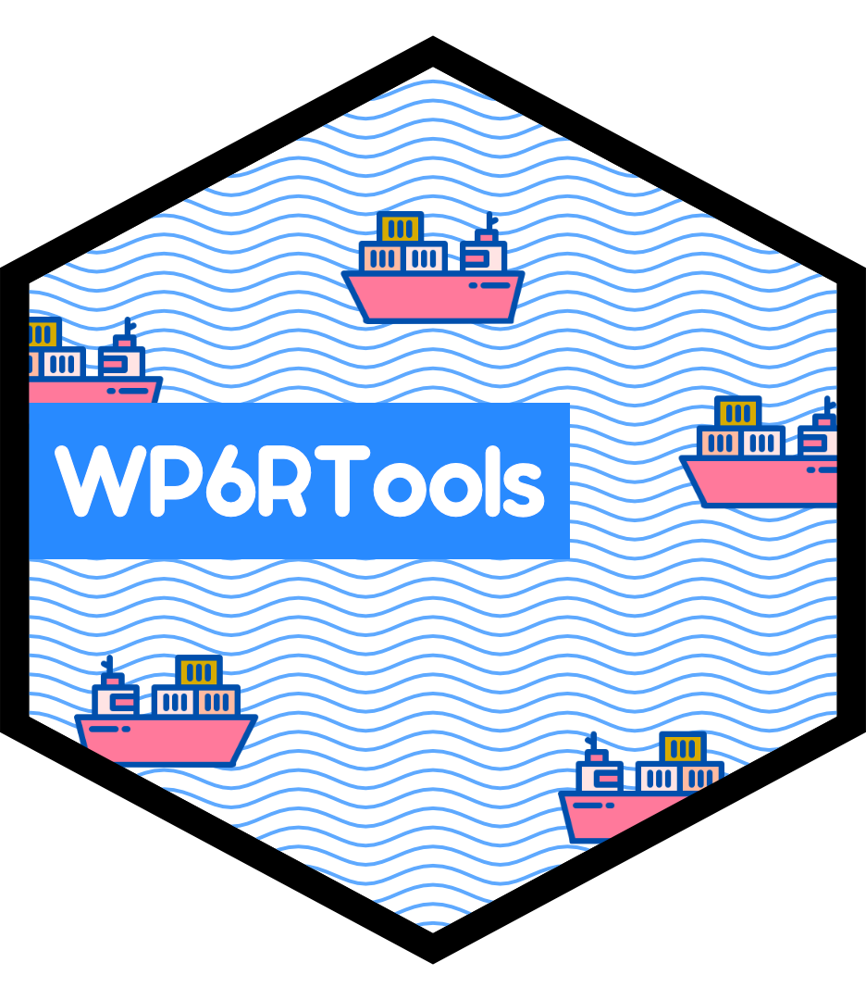

# WP6RTools 


```{r, include = FALSE}
knitr::opts_chunk$set(
  collapse = TRUE,
  comment = "#>",
  fig.path = "man/figures/README-",
  out.width = "100%",
  dpi = 300
)
```

WP6RTools provides a collection of tools to streamline the production process
of data analysis products. At the moment it includes two themes for `{ggplot}`
graphs and a color palette that emulates the OECD colors.

## Installation

Since this package is meant for internal use only, it will not be distributed
with CRAN or be in a public repository on GitHub. You will therefore have to
[contact me](mailto:bernhard.bieri@graduateinstitute.ch) to get an access
token. Once you have it, you can install the internal/development version from
[GitHub](https://github.com/) with:

``` {r, eval = FALSE}
install.packages("remotes") # Lets you install packages from other sources than CRAN
remotes::install_github("BBieri/WP6RTools", auth_token = "YOUR_AUTH_TOKEN")
```
## OECD themes

As mentionned above, the package currently contains two, OECD-styled, themes
for `{ggplot}`. Both themes are essentially modified versions of the
`theme_ipsum()` theme of the
[`{hrbrthemes}`](https://github.com/hrbrmstr/hrbrthemes).

Let's plot some things with the `theme_oecd()` light theme.

```{r examplelight}
# Load required packages
library(WP6RTools) # Our package
library(dplyr) # Manipulation tools for dataframes. Part of the Tidyverse.
library(ggplot2) #
library(hrbrthemes)

# A scatter plot
ggplot(mtcars, aes(mpg, wt)) +
  geom_point() +
  labs(x = "Fuel efficiency (mpg)", y = "Weight (tons)",
       title = "Seminal ggplot2 scatterplot example",
       subtitle = "A plot that is only useful for demonstration purposes",
       caption = "Source: somewhere on the web.") + 
  theme_oecd()

# A tidy histogram
count(mpg, class) %>%
  ggplot(aes(class, n)) +
   geom_col(fill = oecd_palette("oecd", 7, type = "continuous")) +
   geom_text(aes(label = n), nudge_y = 3) +
   labs(x = "Vehicle Category", y = "Number of Vehicles",
        title = "Seminal ggplot2 bar chart example",
        subtitle = "A plot that is only useful for demonstration purposes",
        caption = "Source: somewhere on the web") +
   theme_oecd(grid = "Y") +
   theme(axis.text.y = element_blank())
```

Looking great! Let's check out how these plots look like with the
`theme_oecd_dark()` dark theme.

```{r exampledark}
# Load required packages
library(WP6RTools)
library(dplyr)
library(ggplot2)
library(hrbrthemes)

# A scatter plot
ggplot(mtcars, aes(mpg, wt)) +
  geom_point() +
  labs(x = "Fuel efficiency (mpg)", y = "Weight (tons)",
       title = "Seminal ggplot2 scatterplot example",
       subtitle = "A plot that is only useful for demonstration purposes",
       caption = "Source: somewhere on the web.") + 
  theme_oecd_dark()

# A tidy histogram
count(mpg, class) %>% 
  mutate(pct=n/sum(n)) %>% # Create a new percentage column
  ggplot(aes(class, pct)) + # Create the graph
  geom_col() +
  scale_y_percent() +
  labs(y="Proportion", x="Vehicle category",
       title="Seminal ggplot2 column chart\nexample with percents",
       subtitle="A plot that is only useful for demonstration purposes",
       caption="Source: somewhere on the web.") + 
  theme_oecd_dark(grid="Y")
```

## OECD palette generator

WP6Rtools also includes its very own palette generation tool based on the
included list `oecd_palettes`. You can generate both discrete color palettes
which will take the colors of the aforementionned list or continuous palettes
which will interpolate colors between the ones specified in the `oecd_palettes`
list.

```{r, oecdpalette}
# Discrete palette
discrete <- oecd_palette("oecd", 5, type = "discrete")
discrete
# Continuous palette
continuous <- oecd_palette("oecd", 15, type = "continuous")
continuous
```

## Miscellaneous OECD scraping functions

These functions are intended to produce quickly the list of OECD countries,
OECD Secretary Generals, and data about these two concepts.

``` {r, oecd_misc}
head(oecd_members())
head(oecd_member_metrics())
head(oecd_secretary())
```

## Issues, Improvements and Questions

Have you experienced an issue while using the package or have a question about
it? Open an [issue](https://github.com/BBieri/WP6RTools/issues). Do you want to
suggest improvement? Then open up a
[PR](https://github.com/BBieri/WP6RTools/pulls).

## Final Notes

Note that the present R-Package is in no way related to or endorsed by the OECD.

Please note that the WP6RTools project is released with a
[Contributor Code of Conduct](https://bbieri.github.io/WP6RTools/CODE_OF_CONDUCT.html).
By contributing to this project, you agree to abide by its terms.

