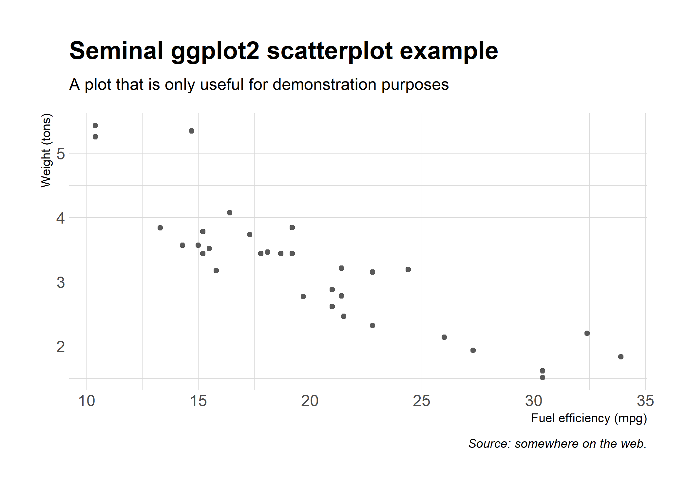
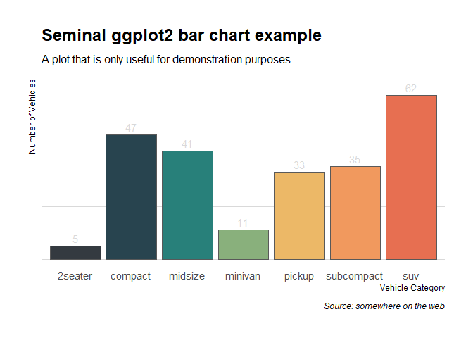
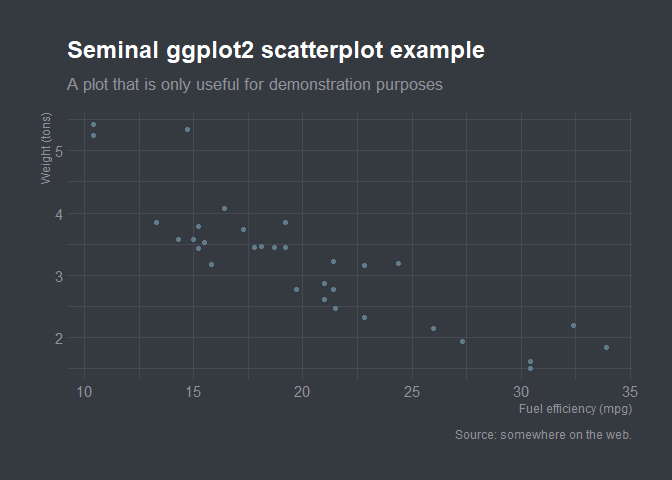
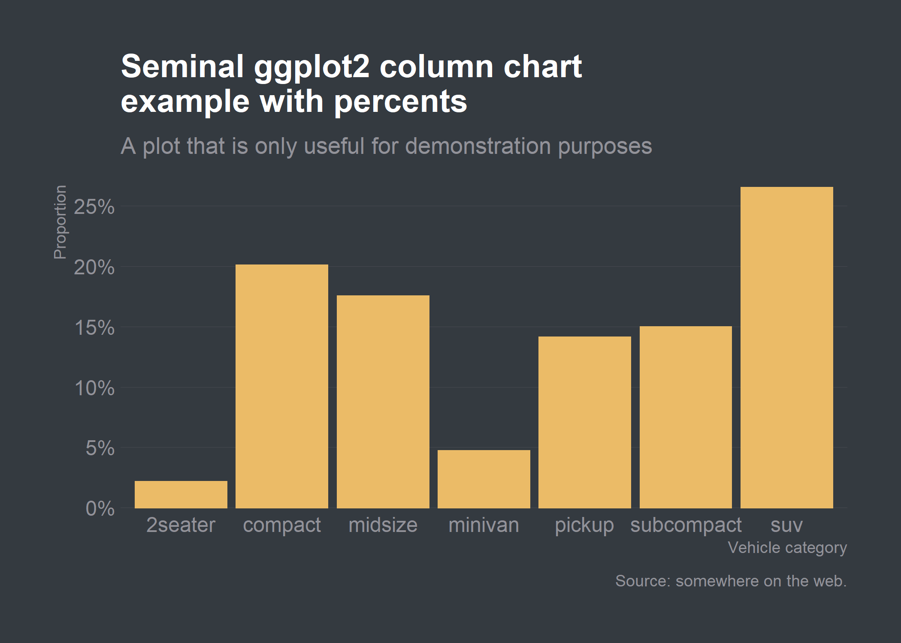
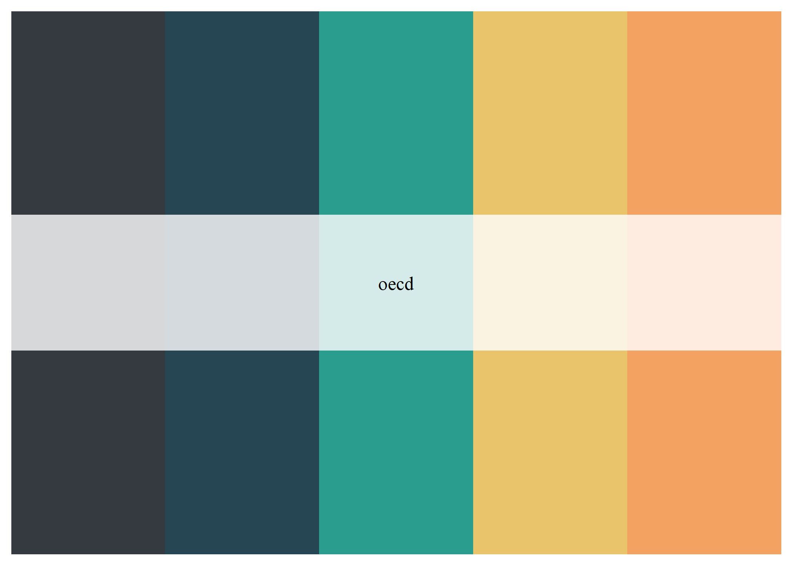
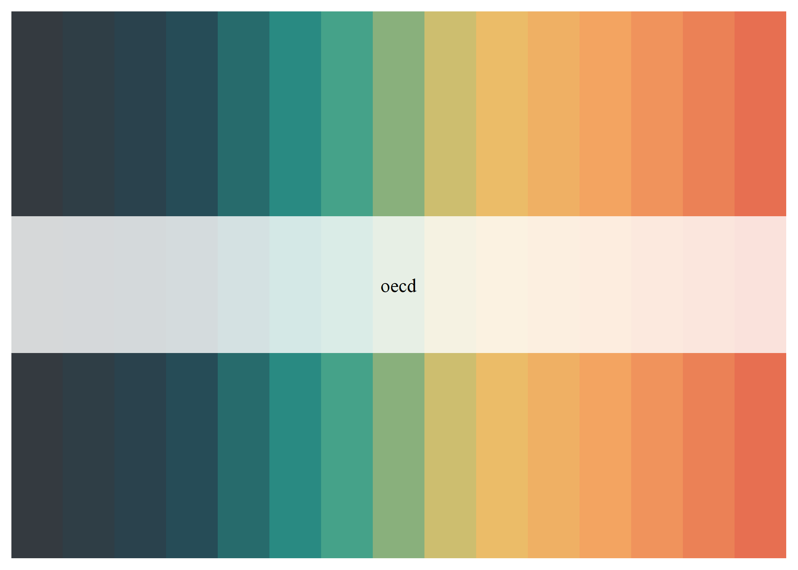

<!-- README.md is generated from README.Rmd. Please edit that file -->

# WP6RTools

<!-- badges: start -->

[](https://github.com/BBieri/WP6RTools/actions)
<!-- badges: end -->

WP6RTools provides a collection of tools to streamline the production
process of data analysis products. At the moment it includes two themes
for `{ggplot}` graphs and a color palette that emulates the OECD colors.

## Installation

Since this package is meant for internal use only, it will not be
distributed with CRAN. You can install the internal/development version
from [GitHub](https://github.com/) with:

``` r
# install.packages("remotes")
remotes::install_github("BBieri/WP6RTools")
```

## OECD themes

As mentionned above, the package currently contains two, OECD-styled,
themes for `{ggplot}`. Both themes are essentially modified versions of
the `theme_ipsum()` theme of the
[`{hrbrthemes}`](https://github.com/hrbrmstr/hrbrthemes).

Let’s plot some things with the `theme_oecd()` light theme.

``` r
# Load required packages
library(WP6RTools) # Our package
library(dplyr) # Manipulation tools for dataframes. Part of the Tidyverse.
#> 
#> Attaching package: 'dplyr'
#> The following objects are masked from 'package:stats':
#> 
#>     filter, lag
#> The following objects are masked from 'package:base':
#> 
#>     intersect, setdiff, setequal, union
library(ggplot2) #
library(hrbrthemes)

# A scatter plot
ggplot(mtcars, aes(mpg, wt)) +
  geom_point() +
  labs(x = "Fuel efficiency (mpg)", y = "Weight (tons)",
       title = "Seminal ggplot2 scatterplot example",
       subtitle = "A plot that is only useful for demonstration purposes",
       caption = "Source: somewhere on the web.") + 
  theme_oecd()
```



``` r
# A tidy histogram
count(mpg, class) %>% 
  mutate(pct=n/sum(n)) %>%  # Create a new percentage column
  ggplot(aes(class, pct)) + # Create the graph
  geom_col() +
  scale_y_percent() +
  labs(y="Proportion", x="Vehicle categories",
       title="Seminal ggplot2 column chart example with percents",
       subtitle="A plot that is only useful for demonstration purposes",
       caption="Source: somewhere on the web.") + 
  theme_oecd(grid="Y")
```



Looking great! Let’s check out how these plots look like with the
`theme_oecd_dark()` dark theme.

``` r
# Load required packages
library(WP6RTools)
library(dplyr)
library(ggplot2)
library(hrbrthemes)

# A scatter plot
ggplot(mtcars, aes(mpg, wt)) +
  geom_point() +
  labs(x = "Fuel efficiency (mpg)", y = "Weight (tons)",
       title = "Seminal ggplot2 scatterplot example",
       subtitle = "A plot that is only useful for demonstration purposes",
       caption = "Source: somewhere on the web.") + 
  theme_oecd_dark()
```



``` r
# A tidy histogram
count(mpg, class) %>% 
  mutate(pct=n/sum(n)) %>% # Create a new percentage column
  ggplot(aes(class, pct)) + # Create the graph
  geom_col() +
  scale_y_percent() +
  labs(y="Proportion", x="Vehicle category",
       title="Seminal ggplot2 column chart example with percents",
       subtitle="A plot that is only useful for demonstration purposes",
       caption="Source: somewhere on the web.") + 
  theme_oecd_dark(grid="Y")
```



## OECD palette generator

WP6Rtools also includes its very own palette generation tool based on
the included list `oecd_palettes`. You can generate both discrete color
palettes which will take the colors of the aforementionned list or
continuous palettes which will interpolate colors between the ones
specified in the `oecd_palettes` list.

``` r
# Discrete palette
discrete <- oecd_palette("oecd", 5, type = "discrete")
discrete
```



``` r
# Continuous palette
continuous <- oecd_palette("oecd", 15, type = "continuous")
continuous
```



## Issues, Improvements and Questions

Have you experienced an issue while using the package or have a question
about it? Open an [issue](https://github.com/BBieri/WP6RTools/issues).
Do you want to suggest improvement? Then open up a
[PR](https://github.com/BBieri/WP6RTools/pulls).
